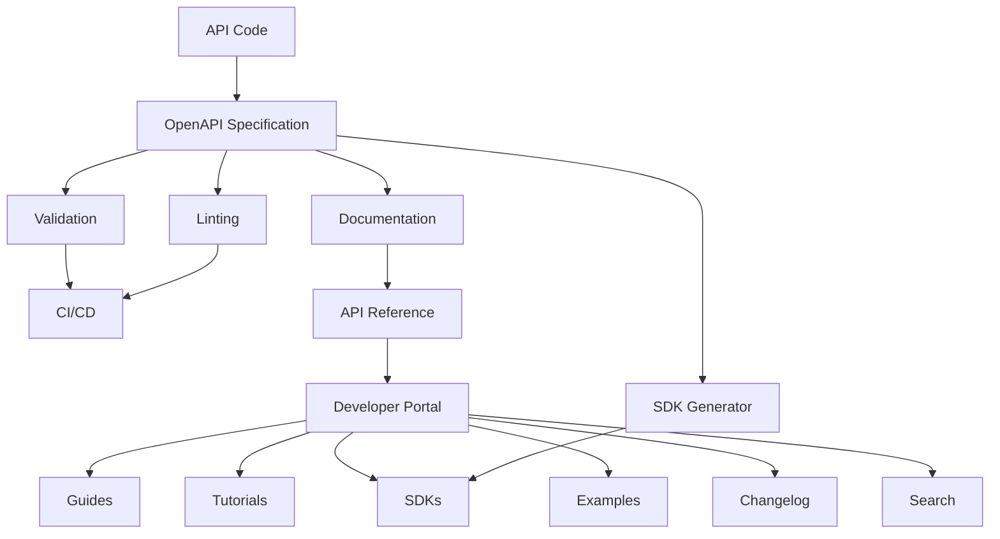
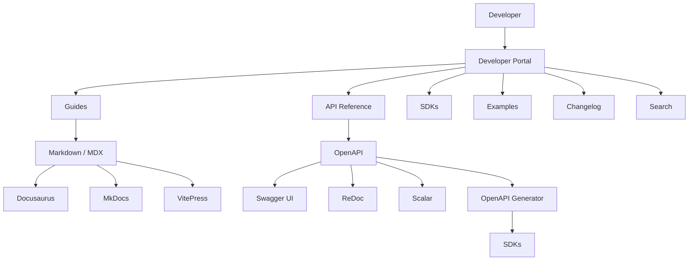
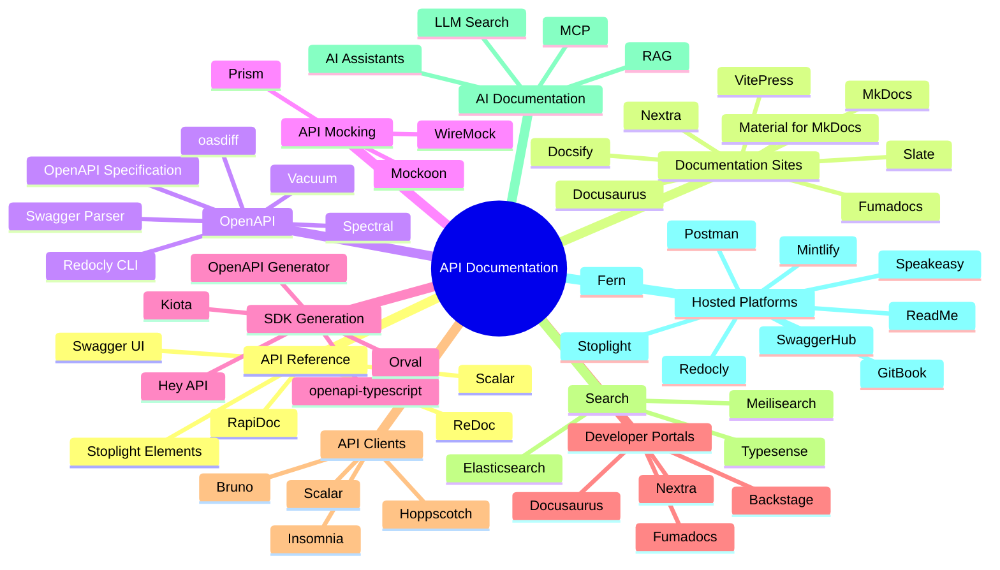

# Awesome-API-Documentation-Platform

## 📚 Top API Documentation Platforms & Open-Source API Docs

> A curated list of **API documentation platforms, developer portals, OpenAPI documentation tools, API reference generators, docs-as-code platforms and open-source API documentation software**.

API documentation platforms sit between an API specification and the developer consuming the API. Modern platforms increasingly combine:

* OpenAPI / Swagger
* API reference documentation
* Developer portals
* Guides and tutorials
* Interactive API explorers
* Try-it consoles
* Code examples
* SDK documentation
* API changelogs
* Search
* Versioning
* Authentication
* API catalogs
* Analytics
* AI-assisted documentation

This repository focuses primarily on **open-source and self-hostable alternatives**, while maintaining a separate list of hosted platforms such as SwaggerHub, ReadMe, Stoplight, Redocly, Mintlify, Document360, Docusaurus, GitBook, Fern, Scalar, Postman and Speakeasy.

A useful distinction is that some products are complete **developer portals**, while others are primarily **OpenAPI renderers or documentation generators**.

```text
                         API DOCUMENTATION
                                │
              ┌─────────────────┼─────────────────┐
              │                 │                 │
              ▼                 ▼                 ▼
        API Reference      Guides / Docs     Developer Portal
              │                 │                 │
              ▼                 ▼                 ▼
          OpenAPI          Markdown / MDX      Search
          Swagger          Tutorials           Versioning
          AsyncAPI         Examples            Analytics
              │                 │                 │
              └─────────────────┼─────────────────┘
                                ▼
                         Developer Experience
```

---

## 📑 Table of Contents

* [☁️ SaaS/Hosted Platforms](#️-saashosted-platforms)
* [🌍 Open-Source](#-open-source)
* [📖 Open-Source API Reference Renderers](#-open-source-api-reference-renderers)
* [📝 Open-Source Documentation Site Generators](#-open-source-documentation-site-generators)
* [⚡ Open-Source API Documentation Platforms](#-open-source-api-documentation-platforms)
* [🔌 Open-Source OpenAPI Tools](#-open-source-openapi-tools)
* [🧪 Open-Source Interactive API Documentation](#-open-source-interactive-api-documentation)
* [🎨 Open-Source Developer Portals](#-open-source-developer-portals)
* [🔄 Open-Source API Docs Generators](#-open-source-api-docs-generators)
* [📦 Open-Source SDK & Code Generation](#-open-source-sdk--code-generation)
* [🔍 Open-Source API Search & Discovery](#-open-source-api-search--discovery)
* [🤖 Open-Source AI Documentation](#-open-source-ai-documentation)
* [🧩 Commercial Platform → Open-Source Equivalent](#-commercial-platform--open-source-equivalent)
* [🏗️ API Documentation Architecture](#️-api-documentation-architecture)
* [🔄 Open-Source API Documentation Pipeline](#-open-source-api-documentation-pipeline)
* [🌐 Developer Portal Architecture](#-developer-portal-architecture)
* [⚖️ Commercial vs Open-Source](#️-commercial-vs-open-source)
* [🚀 Recommended Open-Source Stacks](#-recommended-open-source-stacks)
* [📊 API Documentation Technology Comparison](#-api-documentation-technology-comparison)
* [🎯 Recommended Projects by Use Case](#-recommended-projects-by-use-case)
* [🏢 Building a ReadMe Alternative](#-building-a-readme-alternative)
* [📚 Building a SwaggerHub Alternative](#-building-a-swaggerhub-alternative)
* [🌐 Open-Source API Documentation Landscape](#-open-source-api-documentation-landscape)
* [🧠 Why Open-Source API Documentation Matters](#-why-open-source-api-documentation-matters)
* [🤝 Contributing](#-contributing)
* [⚠️ Disclaimer](#️-disclaimer)

---

# ☁️ SaaS/Hosted Platforms

Commercial API documentation platforms combine documentation publishing with API reference generation, collaboration, analytics, search and developer-portal functionality.

| Platform | Company | Primary Focus | Key Capabilities | Starting Pricing | Free Tier Limits |
| --- | --- | --- | --- | --- | --- |
| [SwaggerHub](https://swagger.io/tools/swaggerhub/) | SmartBear | API design & documentation | OpenAPI, API design, governance, collaboration and documentation | $75/user/month (Team plan, billed annually) | Free plan: up to 3 public APIs, 1 user, no domain documents |
| [ReadMe](https://readme.com/) | ReadMe | Developer portals | Guides, API reference, interactive docs, search and analytics | $250/month (Pro plan, billed annually) | Free plan (Starter): 1 project, 1 user/admin, custom domain & bi-directional sync included |
| [Stoplight](https://stoplight.io/) | Stoplight | API design & docs | OpenAPI, design, governance, documentation and mock servers | $44/month (Basic plan, billed annually) | Free plan: 1 user, 1 project, public API docs; 14-day free trial for paid tiers |
| [Redocly](https://redocly.com/) | Redocly | OpenAPI documentation | API reference, docs-as-code, linting, governance and portals | $10/user/month (Pro plan) | Free plan (Starter): 1 user/project, unlimited API operations, Try-it console |
| [Mintlify](https://mintlify.com/) | Mintlify | Developer documentation | MDX, API reference, AI-assisted docs and developer portals | $450/month (Pro plan, billed annually) | Free plan (Starter): 5 editor seats, custom domain, full platform access (excludes ongoing AI features; 5,000 trial AI credits) |
| [Document360](https://document360.com/) | Kovai.co | Knowledge base / API docs | API documentation, knowledge base, versioning and search | $199/month (Professional plan, billed annually; quote-based) | 14-day free trial with full feature access (no permanent free tier) |
| [Docusaurus](https://docusaurus.io/) | Meta / Open Source | Docs-as-code | Markdown/MDX, versioning, search and static publishing | 100% Free (Open-Source) | Completely free and open-source (MIT license, unlimited local/self-hosted use) |
| [GitBook](https://www.gitbook.com/) | GitBook | Documentation platform | Collaborative docs, Git sync, API docs and publishing | $65/site/month + $12/member/month (Premium plan) | Free plan (Basic): 1 site member, unlimited traffic, public docs, `gitbook.io` subdomain |
| [Fern](https://buildwithfern.com/) | Fern | API docs + SDKs | API references, documentation and SDK generation | $150/month (Team plan, billed annually) | Free plan (Hobby): up to 10 members, 1,000 pages, 2,000 page generations/month, 250 AI credits/month |
| [Scalar](https://scalar.com/) | Scalar | API reference & client | OpenAPI reference, API client, SDK tooling and docs | $125/month (Pro plan, billed annually) | Free plan: 1 editor seat, 3 APIs in registry, 1 SDK target up to 25 endpoints; open-source core is unlimited |
| [Postman](https://www.postman.com/) | Postman | API lifecycle | Collections, testing, documentation, mocks and collaboration | $9/user/month (Solo plan, billed annually) | Free plan: 1 user, unlimited collection runs & mock servers |
| [Postman API Docs](https://www.postman.com/api-platform/api-documentation/) | Postman | API documentation | Interactive references generated from collections | $9/user/month (Solo plan, billed annually) | Free plan: 1 user, unlimited public & private documentation publishing |
| [Speakeasy](https://www.speakeasy.com/) | Speakeasy | API docs + SDKs | OpenAPI, SDK generation, documentation and developer experience | $250/month (Scale-up plan) | Free plan: 1 SDK with up to 50 API methods; 14-day free trial of Business tier |
| [Apiary](https://apiary.io/) | Oracle | API design & docs | API Blueprint, mock servers and documentation | Discontinued (Service retired by Oracle) | Service decommissioned; migration required to alternatives |
| [RapidAPI](https://rapidapi.com/) | RapidAPI | API marketplace | API catalog, documentation, testing and monetization | 25% marketplace transaction fee (RapidAPI Studio core is free) | Free plan per API provider on Hub; Studio tools free for individual developers |
| [ReadMe API Reference](https://readme.com/) | ReadMe | Interactive API docs | OpenAPI-based API reference and developer portal | $250/month (Pro plan, billed annually) | Free plan (Starter): 1 project, interactive playground & metrics included |
| [Bump.sh](https://bump.sh/) | Bump.sh | API documentation | OpenAPI publishing, versioning and changelogs | $120/month (Pro plan) | Free plan (Basic): up to 10 API documents, unlimited team members, custom domain |
| [Theneo](https://www.theneo.io/) | Theneo | AI API documentation | OpenAPI import, automated docs and developer portals | $120/month/workspace (Business plan) | Free plan (Starter): up to 20 members, 1 public project, 2 private projects, 2,000 doc builder ops & 100 search queries/month |
| [Stainless](https://www.stainless.com/) | Stainless | SDK + docs | SDK generation, API documentation and developer experience | Discontinued (Service wound down May 2026 following Anthropic acquisition) | Hosted product discontinued; existing generated SDK code licensed under Apache-2.0 |
| [Docuwiz](https://www.docuwiz.io/) | Docuwiz | API documentation | API reference and documentation publishing | $10/user/month (Standard / custom quote for Enterprise) | Free plan: 1 project/API for individual developers; 14-day free trial for team features |
| [DeveloperHub](https://www.developerhub.io/) | DeveloperHub | Developer portals | API documentation, knowledge bases and developer experience | $99/month (Plus plan, billed annually) | Free plan: 1 editor, 1 documentation section, 1 version, `developerhub.io` subdomain |

Modern API documentation products increasingly combine API references with guides, search, versioning, Git workflows, analytics and AI features rather than treating API reference as a standalone artifact.

---

# 🌍 Open-Source

The open-source ecosystem is much larger than a list of direct "ReadMe alternatives."

It includes:

```text
OpenAPI Specification
        │
        ▼
┌─────────────────────────────────────┐
│       OpenAPI Toolchain             │
├─────────────────────────────────────┤
│ Parsers                             │
│ Validators                          │
│ Linters                             │
│ Bundlers                            │
│ Generators                          │
└──────────────────┬──────────────────┘
                   │
                   ▼
          Documentation Renderer
                   │
       ┌───────────┼───────────┐
       ▼           ▼           ▼
   Swagger UI    ReDoc       Scalar
       │           │           │
       └───────────┼───────────┘
                   ▼
          Documentation Site
                   │
       ┌───────────┼───────────┐
       ▼           ▼           ▼
   Docusaurus     MkDocs      VitePress
       │           │           │
       └───────────┼───────────┘
                   ▼
             Developer Portal
```

Some of the strongest open-source building blocks include **Swagger UI, ReDoc, Scalar, RapiDoc, Stoplight Elements, Docusaurus, MkDocs, Material for MkDocs, VitePress, Nextra, Fumadocs, Slate, Docsify, OpenAPI Generator and Redocly CLI**.

Redoc is explicitly open source and generates responsive API documentation from OpenAPI definitions, while Scalar describes itself as an open-source API platform encompassing API references, an API client and OpenAPI tooling.

---

# 📖 Open-Source API Reference Renderers

API reference renderers transform an OpenAPI / Swagger specification into browsable documentation.

| Project                                                                | Description                                | License / Model |
| ---------------------------------------------------------------------- | ------------------------------------------ | --------------- |
| [Swagger UI](https://github.com/swagger-api/swagger-ui)                | Interactive OpenAPI documentation          | Apache-2.0      |
| [ReDoc](https://github.com/Redocly/redoc)                              | Three-panel OpenAPI documentation renderer | MIT             |
| [Scalar](https://github.com/scalar/scalar)                             | Modern OpenAPI reference + API client      | MIT             |
| [RapiDoc](https://github.com/rapi-doc/RapiDoc)                         | Customizable OpenAPI web component         | MIT             |
| [Stoplight Elements](https://github.com/stoplightio/elements)          | API documentation components               | MIT             |
| [OpenAPI Explorer](https://github.com/DanielTheSaint/openapi-explorer) | Web-component OpenAPI renderer             | MIT             |
| [Rapidoc](https://github.com/rapi-doc/RapiDoc)                         | Interactive API reference                  | MIT             |
| [ZeroMD](https://github.com/zeromd/zeromd)                             | Markdown documentation renderer            | Open source     |
| [DapperDox](https://github.com/DapperDox/dapperdox)                    | OpenAPI documentation server               | Apache-2.0      |

### Swagger UI

[Swagger UI](https://github.com/swagger-api/swagger-ui) remains one of the foundational open-source OpenAPI documentation renderers.

Typical output:

```text
API
├── Authentication
├── Users
│   ├── GET /users
│   ├── POST /users
│   └── GET /users/{id}
├── Orders
│   ├── GET /orders
│   └── POST /orders
└── Schemas
```

Its interactive "Try it out" functionality makes it useful for both internal APIs and public developer portals.

---

# 📘 ReDoc

[ReDoc](https://github.com/Redocly/redoc) generates polished OpenAPI documentation and provides a three-panel responsive layout.

```text
┌──────────────┬──────────────────────┬──────────────────────┐
│ Navigation   │ API Documentation    │ Request / Response   │
│              │                      │ Examples             │
│ Users        │ GET /users           │ curl                 │
│ Orders       │                      │ JavaScript           │
│ Payments     │ Parameters           │ Python               │
│              │ Responses            │ JSON                 │
└──────────────┴──────────────────────┴──────────────────────┘
```

It supports OpenAPI 3.1, 3.0 and Swagger 2.0 and can be used through a CLI, Docker image, HTML element or React component.

---

# ✨ Scalar

[Scalar](https://github.com/scalar/scalar) is a modern open-source API platform centered around OpenAPI/Swagger.

Its ecosystem includes:

* Scalar API Reference
* Scalar API Client
* Scalar Registry
* Scalar Docs
* Scalar CLI
* Scalar Mock Server
* Scalar SDKs
* OpenAPI parser
* OpenAPI-to-Markdown tooling

Scalar describes its API client as offline-first and its API reference as open-source with first-class OpenAPI/Swagger support.

```text
                 Scalar
                    │
        ┌───────────┼───────────┐
        ▼           ▼           ▼
   API Reference  API Client  Registry
        │           │           │
        ▼           ▼           ▼
      OpenAPI    HTTP Requests  Specs
```

---

# 🧩 Open-Source API Documentation Platforms

| Project                                                                           | Primary Function       | Best For                  |
| --------------------------------------------------------------------------------- | ---------------------- | ------------------------- |
| [Swagger UI](https://github.com/swagger-api/swagger-ui)                           | API reference          | OpenAPI reference         |
| [ReDoc](https://github.com/Redocly/redoc)                                         | API reference          | Polished API docs         |
| [Scalar](https://github.com/scalar/scalar)                                        | API platform           | Modern API docs + client  |
| [Stoplight Elements](https://github.com/stoplightio/elements)                     | API docs components    | Embedded API reference    |
| [Docusaurus](https://github.com/facebook/docusaurus)                              | Documentation site     | Full developer portals    |
| [MkDocs](https://github.com/mkdocs/mkdocs)                                        | Static docs            | Markdown docs             |
| [Material for MkDocs](https://github.com/squidfunk/mkdocs-material)               | Docs theme/system      | Production docs           |
| [VitePress](https://github.com/vuejs/vitepress)                                   | Static docs            | Vue/Vite ecosystems       |
| [Nextra](https://github.com/shuding/nextra)                                       | Next.js docs           | React/Next.js docs        |
| [Fumadocs](https://github.com/fuma-nama/fumadocs)                                 | Next.js docs framework | Modern developer docs     |
| [Docsify](https://github.com/docsifyjs/docsify)                                   | Dynamic Markdown docs  | Lightweight docs          |
| [Slate](https://github.com/slatedocs/slate)                                       | API documentation      | API reference             |
| [Docusaurus OpenAPI](https://github.com/PaloAltoNetworks/docusaurus-openapi-docs) | OpenAPI + Docusaurus   | Full docs + API reference |
| [RapiDoc](https://github.com/rapi-doc/RapiDoc)                                    | OpenAPI renderer       | Embedded reference        |

---

# 📝 Open-Source Documentation Site Generators

## Docusaurus

[Docusaurus](https://github.com/facebook/docusaurus) is one of the strongest open-source choices for building a full developer documentation portal.

It supports:

* Markdown
* MDX
* Versioning
* Search integrations
* React components
* Custom themes
* Internationalization
* Static generation
* Blog content
* API documentation integrations

A typical architecture:

```text
Docusaurus
   │
   ├── Guides
   ├── Tutorials
   ├── Concepts
   ├── API Reference
   ├── SDK Reference
   ├── Changelog
   └── Blog
```

---

# 📗 MkDocs

[MkDocs](https://github.com/mkdocs/mkdocs) is a lightweight Markdown-based documentation generator.

It is especially useful for:

* Internal API documentation
* Engineering documentation
* Git-based documentation
* Static hosting
* CI/CD publishing

---

# 🎨 Material for MkDocs

[Material for MkDocs](https://github.com/squidfunk/mkdocs-material) turns MkDocs into a more complete documentation platform.

It provides features such as:

* Navigation
* Search
* Tabs
* Code blocks
* Versioning integrations
* Content organization
* Responsive UI
* Custom themes

It is a particularly strong open-source alternative to hosted documentation platforms when combined with an OpenAPI renderer.

---

# ⚡ VitePress

[VitePress](https://github.com/vuejs/vitepress) is a Vue/Vite-based static site generator designed for documentation.

```text
Markdown / MDX-like Content
          │
          ▼
       VitePress
          │
          ▼
     Static Website
          │
          ▼
 Developer Portal
```

---

# ⚛️ Nextra

[Nextra](https://github.com/shuding/nextra) is a documentation framework built around Next.js and React.

Useful for teams already using:

* React
* Next.js
* TypeScript
* MDX

---

# 📚 Fumadocs

[Fumadocs](https://github.com/fuma-nama/fumadocs) is a modern documentation framework for Next.js.

It is particularly useful for building custom developer portals where teams want more control over the application architecture than a traditional static documentation generator provides.

---

# 🪶 Docsify

[Docsify](https://github.com/docsifyjs/docsify) generates documentation websites directly from Markdown at runtime.

It is useful for:

* Small projects
* Lightweight API docs
* GitHub projects
* Internal documentation
* Zero-build documentation

---

# 🧾 Slate

[Slate](https://github.com/slatedocs/slate) is an open-source API documentation generator focused on clean, readable API reference pages.

A typical Slate-style page combines:

```text
┌───────────────────────┬──────────────────────────┐
│ API Description       │ Request / Code Example   │
│                       │                          │
│ Authentication        │ curl                     │
│ Endpoints             │ Ruby                     │
│ Parameters            │ Python                   │
│ Responses             │ JavaScript               │
└───────────────────────┴──────────────────────────┘
```

---

# 🔌 Open-Source OpenAPI Tools

A production API documentation stack requires more than a renderer.

| Project                                                                    | Role                                 |
| -------------------------------------------------------------------------- | ------------------------------------ |
| [OpenAPI Specification](https://github.com/OAI/OpenAPI-Specification)      | API description standard             |
| [Swagger Parser](https://github.com/swagger-api/swagger-parser)            | OpenAPI parsing / validation         |
| [Redocly CLI](https://github.com/Redocly/redocly-cli)                      | Linting, bundling and transformation |
| [Spectral](https://github.com/stoplightio/spectral)                        | API linting                          |
| [Vacuum](https://github.com/daveshanley/vacuum)                            | OpenAPI linting                      |
| [openapi-generator](https://github.com/OpenAPITools/openapi-generator)     | SDK / server generation              |
| [OpenAPI Generator CLI](https://github.com/OpenAPITools/openapi-generator) | Code generation                      |
| [Prism](https://github.com/stoplightio/prism)                              | Mocking / validation                 |
| [openapi-diff](https://github.com/Tufin/oasdiff)                           | OpenAPI breaking-change detection    |
| [oasdiff](https://github.com/Tufin/oasdiff)                                | OpenAPI comparison                   |
| [openapi-typescript](https://github.com/openapi-ts/openapi-typescript)     | TypeScript generation                |
| [orval](https://github.com/orval-labs/orval)                               | TypeScript clients / mocks           |
| [openapi-zod-client](https://github.com/astahmer/openapi-zod-client)       | Zod client generation                |
| [openapi-cli](https://github.com/OAI/OpenAPI-Specification)                | OpenAPI workflows                    |

---

# 🛡️ Open-Source API Governance

Documentation quality depends heavily on API specification quality.

```text
                API Specification
                       │
                       ▼
                    Spectral
                       │
        ┌──────────────┼──────────────┐
        ▼              ▼              ▼
      Style          Security       Naming
      Rules          Rules          Rules
        │              │              │
        └──────────────┼──────────────┘
                       ▼
                  Valid OpenAPI
                       │
                       ▼
                Documentation
```

## Spectral

[Stoplight Spectral](https://github.com/stoplightio/spectral) is an open-source JSON/YAML linter commonly used for OpenAPI governance.

Typical rules include:

```text
API
├── Operation IDs
├── Tags
├── Descriptions
├── Authentication
├── Error responses
├── Naming conventions
├── Security schemes
└── Versioning
```

## Redocly CLI

[Redocly CLI](https://github.com/Redocly/redocly-cli) provides open-source OpenAPI tooling for:

* Linting
* Validation
* Bundling
* Transformation
* Documentation workflows

Redocly currently describes its CLI as an open-source OpenAPI multi-tool, while Redoc Community Edition remains its open-source API reference renderer.

---

# 🧪 Open-Source Interactive API Documentation

| Project              | Interactive API Requests |       OpenAPI      | Self-Hosted |
| -------------------- | :----------------------: | :----------------: | :---------: |
| Swagger UI           |             ✅            |          ✅         |      ✅      |
| Scalar               |             ✅            |          ✅         |      ✅      |
| Stoplight Elements   |             ✅            |          ✅         |      ✅      |
| ReDoc                |            ⚠️            |          ✅         |      ✅      |
| RapiDoc              |             ✅            |          ✅         |      ✅      |
| Docusaurus + plugins |             ✅            |          ✅         |      ✅      |
| MkDocs + plugins     |             ✅            |          ✅         |      ✅      |
| Slate                |            ⚠️            | Manual / generated |      ✅      |
| Docsify              |     Plugin-dependent     |  Plugin-dependent  |      ✅      |

---

# 🎨 Open-Source Developer Portals

A developer portal is broader than API reference documentation.

```text
                 Developer Portal
                        │
       ┌────────────────┼────────────────┐
       │                │                │
       ▼                ▼                ▼
     Guides        API Reference      SDKs
       │                │                │
       ▼                ▼                ▼
   Tutorials         OpenAPI         Examples
       │                │                │
       └────────────────┼────────────────┘
                        │
                        ▼
                     Search
                        │
                        ▼
                  Authentication
                        │
                        ▼
                    Analytics
```

Strong open-source building blocks include:

| Project            | Portal Role                |
| ------------------ | -------------------------- |
| Docusaurus         | Complete docs site         |
| MkDocs + Material  | Complete docs site         |
| VitePress          | Complete docs site         |
| Nextra             | Next.js developer portal   |
| Fumadocs           | Next.js docs platform      |
| Docsify            | Lightweight docs portal    |
| Backstage          | Developer portal platform  |
| Scalar             | API reference + API client |
| ReDoc              | API reference              |
| Swagger UI         | API reference              |
| Stoplight Elements | API reference components   |

---

# 🏢 Backstage Developer Portals

[Backstage](https://github.com/backstage/backstage) is broader than API documentation, but it can serve as an internal developer portal and API catalog.

```text
                    Backstage
                       │
       ┌───────────────┼────────────────┐
       ▼               ▼                ▼
  API Catalog      Software Catalog   Docs
       │               │                │
       ▼               ▼                ▼
 OpenAPI APIs       Services          TechDocs
       │               │                │
       └───────────────┼────────────────┘
                       ▼
                 Developer Portal
```

This makes Backstage particularly relevant to enterprises building internal API catalogs rather than only public-facing API documentation.

---

# 🔄 Open-Source API Docs Generators

| Project           | Input               | Output                |
| ----------------- | ------------------- | --------------------- |
| ReDoc             | OpenAPI             | HTML                  |
| Swagger UI        | OpenAPI             | Interactive HTML      |
| Scalar            | OpenAPI             | API reference         |
| RapiDoc           | OpenAPI             | Web component         |
| Redocly CLI       | OpenAPI             | Bundled docs / HTML   |
| Docusaurus        | Markdown / MDX      | Static site           |
| MkDocs            | Markdown            | Static site           |
| VitePress         | Markdown            | Static site           |
| Nextra            | MDX                 | Next.js site          |
| Fumadocs          | MDX / content       | Next.js site          |
| Slate             | Markdown / API data | API docs              |
| OpenAPI Generator | OpenAPI             | SDKs / servers / docs |

---

# 📦 Open-Source SDK & Code Generation

API documentation becomes much more useful when developers can immediately obtain SDKs.

| Project                                                                | Purpose                              |
| ---------------------------------------------------------------------- | ------------------------------------ |
| [OpenAPI Generator](https://github.com/OpenAPITools/openapi-generator) | Multi-language SDK/server generation |
| [Kiota](https://github.com/microsoft/kiota)                            | API client generation                |
| [openapi-typescript](https://github.com/openapi-ts/openapi-typescript) | TypeScript types                     |
| [Orval](https://github.com/orval-labs/orval)                           | TypeScript clients                   |
| [Fern](https://github.com/fern-api/fern)                               | API definition / SDK tooling         |
| [Stainless](https://www.stainless.com/)                                | SDK generation platform              |
| [Speakeasy](https://www.speakeasy.com/)                                | SDK generation platform              |
| [Hey API](https://github.com/hey-api/openapi-ts)                       | TypeScript SDK generation            |
| [openapi-zod-client](https://github.com/astahmer/openapi-zod-client)   | Zod clients                          |

A typical pipeline:

```text
OpenAPI
   │
   ├───────────────┐
   ▼               ▼
Documentation     SDK Generator
   │               │
   ▼               ▼
API Reference     TypeScript
   │              Python
   │              Java
   │              Go
   │              C#
   │              Ruby
   │
   └───────────────┐
                   ▼
             Developer Portal
```

---

# 🔍 Open-Source API Search & Discovery

| Project           | Role                          |
| ----------------- | ----------------------------- |
| Backstage         | Internal API/software catalog |
| OpenAPI Directory | Public API specifications     |
| APIs.guru         | Public API definitions        |
| Scalar Registry   | OpenAPI registry              |
| Kong              | API gateway + ecosystem       |
| Tyk               | API gateway / management      |
| Gravitee          | API management                |
| Apache APISIX     | API gateway                   |
| KrakenD           | API gateway                   |
| WSO2 API Manager  | API management                |
| Swagger UI        | API exploration               |

---

# 🤖 Open-Source AI Documentation

The modern documentation stack increasingly includes AI-assisted discovery.

```text
                    Documentation
                         │
             ┌───────────┼───────────┐
             ▼           ▼           ▼
          Markdown     OpenAPI      Code
             │           │           │
             └───────────┼───────────┘
                         ▼
                    AI Indexing
                         │
                         ▼
                  Semantic Search
                         │
                         ▼
                  AI Documentation
                         │
              ┌──────────┴──────────┐
              ▼                     ▼
          AI Chatbot            Coding Agent
```

Open-source components that can be assembled into this layer include:

| Component             | Project                          |
| --------------------- | -------------------------------- |
| Documentation site    | Docusaurus                       |
| API reference         | Scalar / ReDoc                   |
| Search                | Meilisearch / Typesense          |
| Vector database       | Qdrant / Weaviate                |
| LLM serving           | vLLM                             |
| RAG framework         | LlamaIndex / Haystack            |
| Embeddings            | Sentence Transformers            |
| AI agent              | Open-source LLM + custom tooling |
| API specification     | OpenAPI                          |
| Documentation linting | Spectral                         |
| API discovery         | Backstage                        |

---

# 🧩 Commercial Platform → Open-Source Equivalent

| Commercial Platform       | Open-Source Equivalent / Building Blocks                    |
| ------------------------- | ----------------------------------------------------------- |
| **SwaggerHub**            | Swagger UI + Redocly CLI + Spectral + Docusaurus            |
| **ReadMe**                | Docusaurus + Scalar/ReDoc + search + analytics              |
| **Stoplight**             | Docusaurus + Spectral + Prism + Scalar                      |
| **Redocly**               | ReDoc + Redocly CLI + Docusaurus                            |
| **Mintlify**              | Docusaurus / Nextra / Fumadocs + OpenAPI + search           |
| **Document360**           | Docusaurus / MkDocs Material + OpenAPI renderer             |
| **Docusaurus**            | Already open source; extend with Scalar/ReDoc               |
| **GitBook**               | Docusaurus / MkDocs Material / VitePress                    |
| **Fern**                  | OpenAPI Generator + Docusaurus + ReDoc/Scalar               |
| **Scalar**                | Already open source; Scalar API Reference + Docs            |
| **Postman API Docs**      | Swagger UI / Scalar + OpenAPI + Docusaurus                  |
| **Postman**               | Bruno / Hoppscotch + OpenAPI + Docusaurus                   |
| **Speakeasy**             | OpenAPI Generator + Docusaurus + custom SDK pipeline        |
| **Apiary**                | OpenAPI + Prism + Docusaurus                                |
| **RapidAPI Studio**       | OpenAPI + Swagger UI + custom API catalog                   |
| **Bump.sh**               | ReDoc + GitHub Actions + OpenAPI diff                       |
| **Theneo**                | OpenAPI + Docusaurus + AI generation                        |
| **DeveloperHub**          | Docusaurus / Backstage + OpenAPI                            |
| **Stainless**             | OpenAPI Generator + custom SDK templates                    |
| **Full Developer Portal** | Docusaurus + Scalar + Spectral + OpenAPI Generator + search |

---

# 🏗️ API Documentation Architecture



---

# 🔄 Open-Source API Documentation Pipeline

The ideal docs-as-code workflow is:

```text
                   API Source Code
                         │
                         ▼
                   OpenAPI Spec
                         │
             ┌───────────┼───────────┐
             ▼           ▼           ▼
          Validate      Lint       Diff
             │           │           │
             └───────────┼───────────┘
                         ▼
                       CI/CD
                         │
          ┌──────────────┼──────────────┐
          ▼              ▼              ▼
      API Reference     SDKs        Mock Server
          │              │              │
          └──────────────┼──────────────┘
                         ▼
                 Developer Portal
                         │
                         ▼
                      Deploy
```

---

# 🌐 Developer Portal Architecture



---

# 🔐 API Documentation Security

API documentation should not accidentally expose:

* Production API keys
* Internal endpoints
* Credentials
* Private schemas
* Internal hostnames
* Sensitive examples
* Customer data
* Administrative APIs
* Undocumented security mechanisms

A useful deployment architecture is:

```text
Private API Specification
          │
          ▼
      CI Pipeline
          │
     Security Checks
          │
          ▼
   Public Documentation
          │
          ▼
     Developer Portal
```

Public and private specifications should ideally be treated as separate publication targets.

---

# ⚖️ Commercial vs Open-Source

| Capability            | Commercial Platform  | Open-Source Stack            |
| --------------------- | -------------------- | ---------------------------- |
| API Reference         | ✅                    | ✅                            |
| OpenAPI               | ✅                    | ✅                            |
| Markdown Docs         | ✅                    | ✅                            |
| Guides                | ✅                    | ✅                            |
| Search                | ✅                    | ✅                            |
| Versioning            | ✅                    | ✅                            |
| Interactive API       | ✅                    | ✅                            |
| Code Examples         | ✅                    | ✅                            |
| SDK Generation        | Often                | ✅                            |
| API Governance        | Often                | ✅                            |
| Linting               | Often                | ✅                            |
| Mocking               | Often                | ✅                            |
| Analytics             | Usually              | Build / integrate            |
| Authentication        | Usually              | Build / integrate            |
| Customization         | Medium               | Very High                    |
| Self-Hosting          | Limited / varies     | ✅                            |
| Source Code           | Proprietary          | ✅                            |
| Data Ownership        | Vendor-dependent     | Full control                 |
| Air-Gapped Deployment | Limited              | ✅                            |
| Vendor Lock-In        | Higher               | Lower                        |
| Time to Market        | Fast                 | Moderate                     |
| Infrastructure        | Managed              | Self-managed                 |
| Maintenance           | Vendor               | Your team                    |
| AI Assistant          | Increasingly common  | Build / integrate            |
| Cost at Scale         | Subscription / usage | Infrastructure + engineering |

---

# 🚀 Recommended Open-Source Stacks

## 🏆 1. Best General-Purpose API Documentation

```text
Docusaurus
+
Scalar
+
OpenAPI
+
Spectral
+
OpenAPI Generator
```

Best for:

* Public APIs
* Developer portals
* SaaS companies
* Open-source projects
* Git-based workflows

---

# 📘 2. ReadMe Alternative

```text
Docusaurus
+
Scalar / ReDoc
+
OpenAPI
+
Algolia / Meilisearch
+
GitHub Actions
+
OpenAPI Generator
```

Architecture:

```text
                    Docusaurus
                        │
        ┌───────────────┼───────────────┐
        ▼               ▼               ▼
      Guides        API Reference      SDKs
        │               │               │
        │            Scalar            │
        │            / ReDoc            │
        │               │               │
        └───────────────┼───────────────┘
                        ▼
                     Search
```

---

# 🧭 3. SwaggerHub Alternative

```text
OpenAPI
+
Spectral
+
Redocly CLI
+
Swagger UI
+
Docusaurus
+
GitHub Actions
```

Pipeline:

```text
OpenAPI
   │
   ▼
Spectral
   │
   ▼
Redocly CLI
   │
   ├── Bundle
   ├── Validate
   └── Lint
   │
   ▼
Swagger UI / ReDoc
   │
   ▼
Docusaurus
```

---

# ⚡ 4. Lightweight API Documentation

```text
OpenAPI
+
Scalar
+
Static Hosting
```

This can be deployed using:

* GitHub Pages
* Cloudflare Pages
* Netlify
* Vercel
* S3-compatible storage
* Any static web server

---

# 🎨 5. Markdown-First Documentation

```text
Markdown
   │
   ▼
MkDocs
   │
   ▼
Material for MkDocs
   │
   ├── Guides
   ├── Tutorials
   ├── API Reference
   └── Examples
```

---

# ⚛️ 6. React / Next.js Developer Portal

```text
Next.js
+
Fumadocs / Nextra
+
Scalar
+
OpenAPI
+
TypeScript
+
Meilisearch
```

Best for teams wanting a fully customized documentation application.

---

# 🔧 7. Enterprise API Documentation

```text
                 Git Repository
                       │
                       ▼
                    OpenAPI
                       │
             ┌─────────┼─────────┐
             ▼         ▼         ▼
          Spectral   oasdiff   Redocly
             │         │         │
             └─────────┼─────────┘
                       ▼
                      CI
                       │
        ┌──────────────┼──────────────┐
        ▼              ▼              ▼
     Scalar          SDKs         Mock Server
        │              │              │
        └──────────────┼──────────────┘
                       ▼
                  Docusaurus
                       │
                       ▼
               Developer Portal
```

---

# 📊 API Documentation Technology Comparison

| Project             |   API Reference  |  Docs Site |       OpenAPI      |    Interactive   |  SDK Generation  | Self-Host |
| ------------------- | :--------------: | :--------: | :----------------: | :--------------: | :--------------: | :-------: |
| Swagger UI          |         ✅        |      ❌     |          ✅         |         ✅        |         ❌        |     ✅     |
| ReDoc               |         ✅        |      ❌     |          ✅         |        ⚠️        |         ❌        |     ✅     |
| Scalar              |         ✅        |      ✅     |          ✅         |         ✅        |         ✅        |     ✅     |
| RapiDoc             |         ✅        |      ❌     |          ✅         |         ✅        |         ❌        |     ✅     |
| Stoplight Elements  |         ✅        | Components |          ✅         |         ✅        |        ⚠️        |     ✅     |
| Docusaurus          |    Via plugins   |      ✅     |     Via plugins    |    Via plugins   |    Via plugins   |     ✅     |
| MkDocs              |    Via plugins   |      ✅     |     Via plugins    |    Via plugins   |    Via plugins   |     ✅     |
| Material for MkDocs |    Via plugins   |      ✅     |     Via plugins    |    Via plugins   |    Via plugins   |     ✅     |
| VitePress           |    Via plugins   |      ✅     |     Via plugins    |    Via plugins   |    Via plugins   |     ✅     |
| Nextra              |    Via plugins   |      ✅     |     Via plugins    |    Via plugins   |    Via plugins   |     ✅     |
| Fumadocs            | Via integrations |      ✅     |  Via integrations  | Via integrations | Via integrations |     ✅     |
| Docsify             |    Via plugins   |      ✅     |     Via plugins    |    Via plugins   |         ❌        |     ✅     |
| Slate               |         ✅        |     ⚠️     | Manual / generated |        ⚠️        |         ❌        |     ✅     |
| Backstage           |    Via plugins   |      ✅     |          ✅         |    Via plugins   |    Via plugins   |     ✅     |
| OpenAPI Generator   |         ❌        |  Generated |          ✅         |         ❌        |         ✅        |     ✅     |
| Redocly CLI         |     Generated    |     ⚠️     |          ✅         |        ⚠️        |         ❌        |     ✅     |

---

# 🎯 Recommended Projects by Use Case

| Use Case                             | Recommended Starting Point                       |
| ------------------------------------ | ------------------------------------------------ |
| Best open-source API reference       | **Swagger UI**                                   |
| Best polished OpenAPI reference      | **ReDoc**                                        |
| Modern API reference + client        | **Scalar**                                       |
| Full developer portal                | **Docusaurus**                                   |
| Markdown-first docs                  | **MkDocs + Material**                            |
| Next.js documentation                | **Fumadocs / Nextra**                            |
| Vue documentation                    | **VitePress**                                    |
| Lightweight Markdown site            | **Docsify**                                      |
| API documentation with custom design | **RapiDoc**                                      |
| API governance                       | **Spectral**                                     |
| OpenAPI linting + bundling           | **Redocly CLI**                                  |
| API mocking                          | **Prism**                                        |
| API contract testing                 | **Prism + OpenAPI**                              |
| SDK generation                       | **OpenAPI Generator**                            |
| TypeScript SDK/types                 | **openapi-typescript / Orval**                   |
| API breaking-change detection        | **oasdiff**                                      |
| Internal developer portal            | **Backstage**                                    |
| Modern OpenAPI ecosystem             | **Scalar**                                       |
| ReadMe alternative                   | **Docusaurus + Scalar**                          |
| SwaggerHub alternative               | **Docusaurus + Spectral + Redocly CLI**          |
| Mintlify alternative                 | **Docusaurus / Nextra / Fumadocs**               |
| GitBook alternative                  | **Docusaurus / MkDocs / VitePress**              |
| Fern alternative                     | **OpenAPI Generator + Docusaurus**               |
| Postman Docs alternative             | **Scalar / Swagger UI + Docusaurus**             |
| Enterprise API docs                  | **Docusaurus + Scalar + Spectral + Redocly CLI** |

---

# 🏢 Building a ReadMe Alternative

A ReadMe-style developer portal can be assembled entirely from open-source components.

```text
                        Developer
                            │
                            ▼
                   ┌─────────────────┐
                   │   Docusaurus    │
                   └────────┬────────┘
                            │
       ┌────────────────────┼────────────────────┐
       │                    │                    │
       ▼                    ▼                    ▼
    Guides             API Reference           SDKs
       │                    │                    │
       │                 Scalar                OpenAPI
       │                 / ReDoc              Generator
       │                    │                    │
       └────────────────────┼────────────────────┘
                            ▼
                         Search
                            │
                            ▼
                    Meilisearch / Algolia
```

### Suggested Stack

```text
Frontend / Docs
    → Docusaurus

API Reference
    → Scalar / ReDoc

API Specification
    → OpenAPI

Governance
    → Spectral

Bundling
    → Redocly CLI

Mocking
    → Prism

SDK Generation
    → OpenAPI Generator

Search
    → Meilisearch

CI/CD
    → GitHub Actions

Hosting
    → Cloudflare Pages / GitHub Pages / Kubernetes
```

---

# 📚 Building a SwaggerHub Alternative

SwaggerHub combines API design, collaboration, OpenAPI governance and documentation.

An open-source approximation can be:

```text
                   OpenAPI Repository
                          │
                          ▼
                       GitHub
                          │
             ┌────────────┼────────────┐
             ▼            ▼            ▼
          Spectral      oasdiff     Redocly
             │            │            │
             └────────────┼────────────┘
                          ▼
                        CI/CD
                          │
             ┌────────────┼────────────┐
             ▼            ▼            ▼
         Swagger UI      ReDoc       Scalar
             │            │            │
             └────────────┼────────────┘
                          ▼
                    Docusaurus
                          │
                          ▼
                  Developer Portal
```

---

# 🔄 API Documentation as Code

The strongest open-source architecture is often **docs-as-code**:

```text
Developer
    │
    ▼
Git Repository
    │
    ├── openapi.yaml
    ├── docs/
    ├── examples/
    └── sdk/
    │
    ▼
Pull Request
    │
    ▼
CI
    │
    ├── Validate
    ├── Lint
    ├── Diff
    ├── Test
    └── Generate
    │
    ▼
Build Documentation
    │
    ▼
Deploy
```

This approach makes documentation part of the same software-development lifecycle as the API itself.

---

# 🌐 Open-Source API Documentation Landscape



---

# 🧠 Why Open-Source API Documentation Matters

API documentation is becoming part of the **API delivery pipeline**, rather than simply a website written after development.

A modern API lifecycle looks like:

```text
API Design
    │
    ▼
OpenAPI
    │
    ▼
Governance
    │
    ▼
Implementation
    │
    ▼
Testing
    │
    ▼
Documentation
    │
    ▼
SDK Generation
    │
    ▼
Developer Portal
    │
    ▼
Analytics / Feedback
```

Open-source tooling makes it possible to own almost every part of this workflow.

```text
                    OPEN-SOURCE API STACK

       ┌──────────────────────────────────────┐
       │           Developer Portal           │
       │       Docusaurus / Fumadocs          │
       └──────────────────┬───────────────────┘
                          │
       ┌──────────────────▼───────────────────┐
       │           API Reference              │
       │       Scalar / ReDoc / Swagger UI    │
       └──────────────────┬───────────────────┘
                          │
       ┌──────────────────▼───────────────────┐
       │              OpenAPI                 │
       │        Specification / Schemas       │
       └──────────────────┬───────────────────┘
                          │
       ┌──────────────────▼───────────────────┐
       │         Governance / Quality         │
       │ Spectral / Redocly CLI / oasdiff     │
       └──────────────────┬───────────────────┘
                          │
       ┌──────────────────▼───────────────────┐
       │         SDK / Client Generation      │
       │        OpenAPI Generator / Kiota     │
       └──────────────────────────────────────┘
```

The key advantage is **composability**.

Instead of depending on one proprietary platform for the entire documentation lifecycle, an organization can combine specialized open-source components.

---

# 🏆 Recommended Open-Source Reference Architecture

For a serious production API documentation platform:

```text
┌────────────────────────────────────────────────────┐
│                  DEVELOPER PORTAL                  │
│                   Docusaurus                      │
├────────────────────────────────────────────────────┤
│                 API REFERENCE                     │
│                Scalar / ReDoc                     │
├────────────────────────────────────────────────────┤
│                    CONTENT                        │
│                  MDX / Markdown                   │
├────────────────────────────────────────────────────┤
│                    OPENAPI                        │
│             OpenAPI 3.x / Swagger                 │
├────────────────────────────────────────────────────┤
│                 GOVERNANCE                        │
│          Spectral + Redocly CLI                   │
├────────────────────────────────────────────────────┤
│                 CONTRACT TESTING                   │
│                   Prism                           │
├────────────────────────────────────────────────────┤
│                CHANGE DETECTION                   │
│                   oasdiff                         │
├────────────────────────────────────────────────────┤
│                  SDK GENERATION                   │
│               OpenAPI Generator                   │
├────────────────────────────────────────────────────┤
│                    SEARCH                         │
│             Meilisearch / Typesense               │
├────────────────────────────────────────────────────┤
│                    CI/CD                          │
│                 GitHub Actions                    │
└────────────────────────────────────────────────────┘
```

---

# 🛠️ Example Repository Structure

A complete open-source API documentation repository could look like:

```text
api-docs/
│
├── openapi/
│   ├── openapi.yaml
│   ├── components.yaml
│   └── schemas/
│
├── docs/
│   ├── introduction.md
│   ├── authentication.md
│   ├── quickstart.md
│   ├── guides/
│   ├── tutorials/
│   ├── concepts/
│   └── changelog.md
│
├── examples/
│   ├── curl/
│   ├── python/
│   ├── javascript/
│   └── typescript/
│
├── sdk/
│   ├── python/
│   ├── typescript/
│   └── java/
│
├── scripts/
│   ├── validate.sh
│   ├── lint.sh
│   └── generate.sh
│
├── docusaurus.config.ts
├── sidebars.ts
├── spectral.yaml
├── package.json
└── README.md
```

---

# 🚀 Minimal Open-Source API Docs

For a small project, you can reduce the entire stack to:

```text
OpenAPI
   +
Scalar
   +
GitHub Pages
```

Or:

```text
OpenAPI
   +
Swagger UI
   +
GitHub Pages
```

For a larger project:

```text
OpenAPI
+
Spectral
+
oasdiff
+
Scalar
+
Docusaurus
+
OpenAPI Generator
+
Meilisearch
+
GitHub Actions
```

---

# 🤝 Contributing

Contributions are welcome!

Please consider adding:

* Open-source API documentation tools
* OpenAPI renderers
* Swagger documentation tools
* Developer portals
* Docs-as-code frameworks
* Static documentation generators
* API reference components
* API mock servers
* OpenAPI linters
* OpenAPI validators
* API governance tools
* API diff tools
* SDK generators
* API catalogs
* API search tools
* AI documentation tools
* Documentation search engines
* API changelog tools
* API versioning tools
* Self-hosted documentation platforms

When adding a project, please distinguish between:

* **Fully open-source**
* **Open-core**
* **Source available**
* **Open-source library**
* **Hosted commercial product**
* **Commercial product built on open-source software**

Do not classify a proprietary hosted documentation platform as open source merely because it supports Markdown, OpenAPI or Git synchronization.

---

# ⚠️ Disclaimer

This repository is an independent technical curation and is **not affiliated with or endorsed by any company or project listed here**.

API documentation platforms vary substantially in scope.

Some primarily provide:

* OpenAPI rendering

while others provide:

* Documentation authoring
* Developer portals
* API design
* API governance
* SDK generation
* API testing
* Analytics
* Search
* Authentication
* Collaboration
* AI assistants

Consequently, a collection of open-source projects may reproduce the **functionality** of a commercial platform without being a direct one-to-one replacement.

Licensing can also differ between source code, plugins, themes, generated artifacts and hosted services. Always verify the current license before commercial deployment.

---

## ⭐ Star This Repository

If you are interested in:

* API Documentation
* API Design
* OpenAPI
* Swagger
* Developer Portals
* Docs-as-Code
* API Governance
* API Reference
* SDK Generation
* Developer Experience
* Open-Source Developer Tools

consider giving this repository a ⭐ **Star** and contributing new projects.

---

**Last updated: September 2026**

